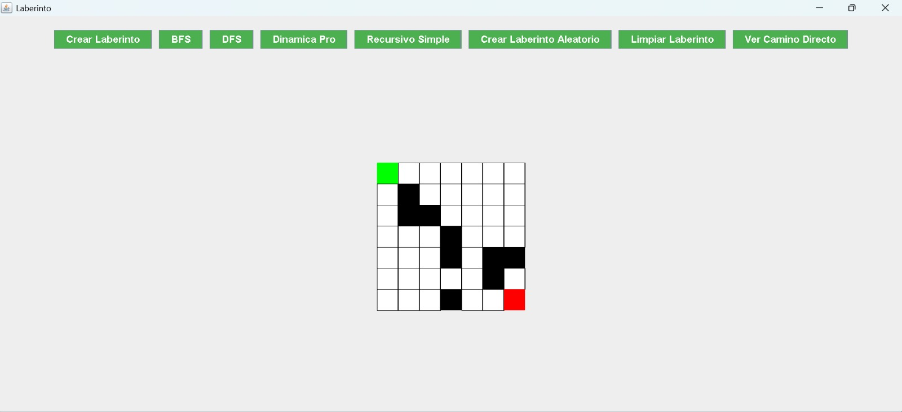
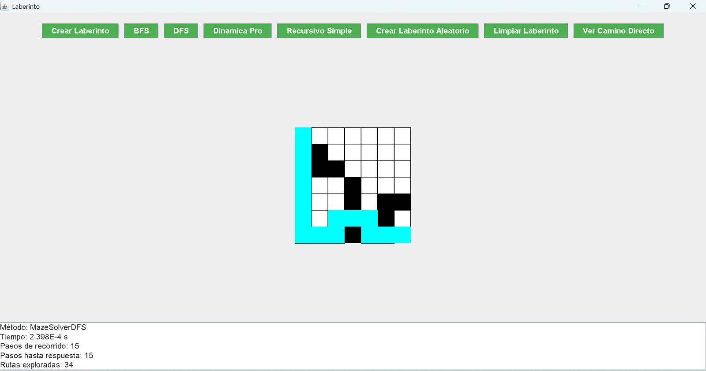

## Proyecto Laberinto

## Autores
- Denisse Paredes - dparedesp5@est.ups.edu.ec
- Cristina Loja - clojap1@est.ups.edu.ec
- Ariana Riofrío - ariofriot@est.ups.edu.ec

## 📸 Capturas de la Implementación de la UI
### 📌 Generación  y resulución del Laberinto

## Materia
Estructura de Datos

## Docente
Ing. Pablo Torres

## Descripción

Este proyecto implementa una aplicación gráfica en Java para la creación y resolución de laberintos utilizando diferentes algoritmos. Los usuarios pueden generar laberintos manualmente o aleatoriamente, establecer puntos de inicio y fin, y resolver el laberinto utilizando algoritmos como:

- BFS (Breadth-First Search)
- DFS (Depth-First Search)
- Programación Dinámica
- Recursión Simple

## Tecnologías Utilizadas

- Java
- Swing (para la interfaz gráfica)
- Algoritmos de búsqueda y optimización

## Características

- Creación de laberintos de tamaño personalizado o aleatorio.
- Interfaz gráfica interactiva con selección manual de inicio y fin.
- Implementación de múltiples algoritmos de resolución.
- Visualización del mejor camino encontrado.
- Resumen detallado de la solución (tiempo de ejecución, número de pasos, rutas exploradas).

## Estructura del Proyecto

El proyecto se organizó en varios módulos para una mejor comprensión y mantenimiento:

- *Interfaz gráfica*: Implementada en Java utilizando Swing para permitir la interacción con el usuario.
- *Lógica del Laberinto*: Algoritmos de generación y resolución de laberintos implementados en clases independientes.
- *Algoritmos de Resolución*:
  - BFS (Breadth-First Search): Encuentra el camino más corto en un grafo no ponderado.
  - DFS (Depth-First Search): Explora todos los caminos posibles antes de retroceder.
  - Programación Dinámica: Optimiza la búsqueda almacenando resultados previos.
  - Método Recursivo Simple: Explora todas las posibilidades mediante recursión.
- *Documentación*: Incluye el README con instrucciones de instalación, uso y explicación de los algoritmos.

## Comparación de Métodos

### Recursiva (DFS)
*Pros:* Fácil de implementar, buena para encontrar cualquier camino.
*Contras:* Puede ser ineficiente en términos de tiempo y espacio para laberintos grandes debido a la profundidad de la recursión.

### Búsqueda en Anchura (BFS)
*Pros:* Garantiza encontrar el camino más corto en un grafo no ponderado.
*Contras:* Puede consumir más memoria debido a la necesidad de almacenar todos los nodos en el nivel actual.

### Programación Dinámica
*Pros:* Optimiza el tiempo de ejecución al almacenar los resultados de subproblemas ya resueltos.
*Contras:* La implementación puede ser más compleja y requiere memoria adicional para almacenar los resultados.

### Mejor Opción
La mejor opción para encontrar el camino más corto en un laberinto es la Búsqueda en Anchura (BFS). Esto se debe a que BFS explora todos los caminos posibles nivel por nivel, garantizando así el camino más corto en un grafo no ponderado. Aunque puede consumir más memoria, su capacidad para encontrar la solución óptima de manera consistente la hace superior a otros métodos en términos de encontrar el camino más corto.

## Instalación y Uso

1. Clonar el repositorio

   sh
   git clone https://github.com/tu-repositorio/laberinto-java.git
   cd laberinto-java
   

2. Compilar el proyecto

   sh
   javac -d bin src/**/*.java
   

3. Ejecutar la aplicación

   sh
   java -cp bin App
   

## Cómo Usar la Aplicación

1. Ejecutar el programa.
2. Hacer clic en "Crear Laberinto" e ingresar el tamaño deseado.
3. Seleccionar con clic derecho el punto de inicio y final.
4. Elegir un algoritmo de resolución (BFS, DFS, Dinámica o Recursivo).
5. Observar el resultado y análisis del rendimiento.

## Contribuciones de los Integrantes

### Cristina Loja
Se enfocó en el desarrollo de la interfaz de usuario y la visualización de rutas. Comprendió la importancia de una UI intuitiva y eficiente para el análisis de algoritmos.

### Ariana Riofrío
Trabajó en la codificación de los algoritmos de búsqueda y resolución del laberinto. Aprendió sobre la eficiencia de los diferentes métodos y su impacto en la solución.

### Denisse Paredes
Desarrolló la documentación, el README y el informe. Se centró en explicar claramente cada parte del proyecto, facilitando la comprensión y futuras mejoras.

## Conclusión

### Implementación de Algoritmos
Este proyecto permitió la implementación y comparación de diferentes algoritmos de búsqueda para la resolución de laberintos. Se pudo analizar su eficiencia y entender la importancia de la estructura de datos utilizada en cada método.

### Desarrollo de la Interfaz
El diseño de una interfaz gráfica intuitiva y funcional resultó crucial para la visualización de los algoritmos en acción. Se logró una UI clara y eficiente que permite la interacción con el usuario de manera sencilla.

### Documentación y Organización
La documentación detallada del proyecto facilita su comprensión y futuras mejoras. Contar con un README bien estructurado y un informe claro ayuda a mantener el código accesible y comprensible para otros desarrolladores.

### Aprendizaje y Futuras Mejoras
Cada integrante reforzó sus conocimientos en su área de contribución, desde la optimización de algoritmos hasta la documentación. Como posibles mejoras futuras, se podría implementar el algoritmo A* para laberintos ponderados, optimizar el uso de memoria y extender la funcionalidad a laberintos tridimensionales.